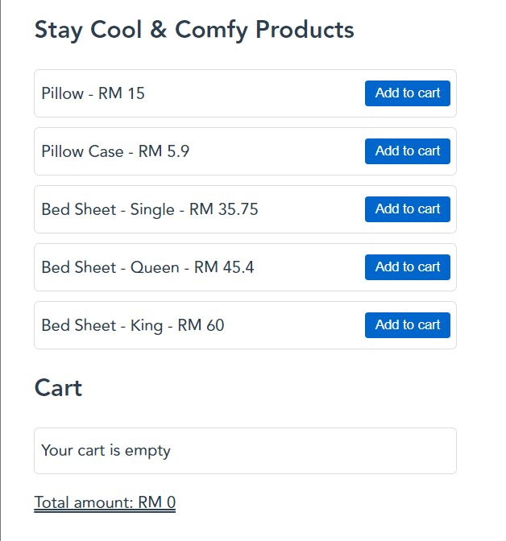
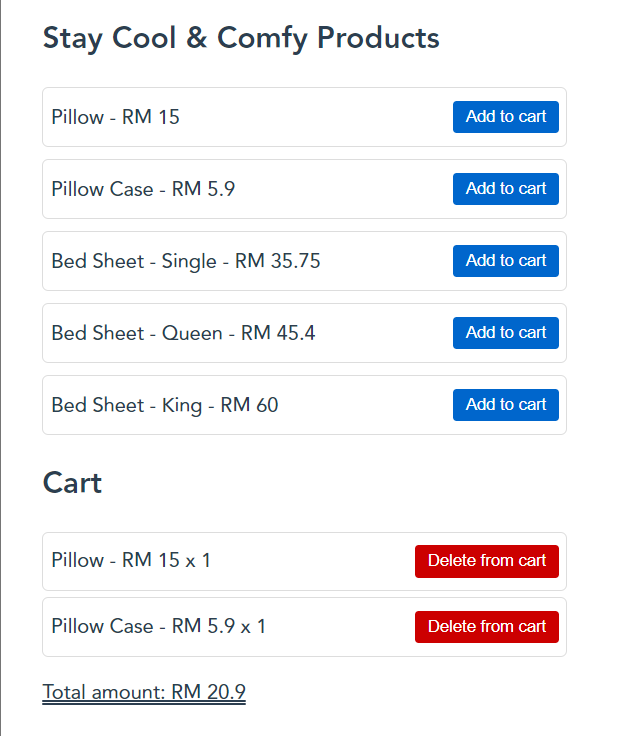

# add-to-cart

## Project Overview
A simple add-to-cart function that includes add, delete, calculate total amount and a JSON to store cart items in local storage.

## Screenshots

  
  

## To be added

- `Product images`
